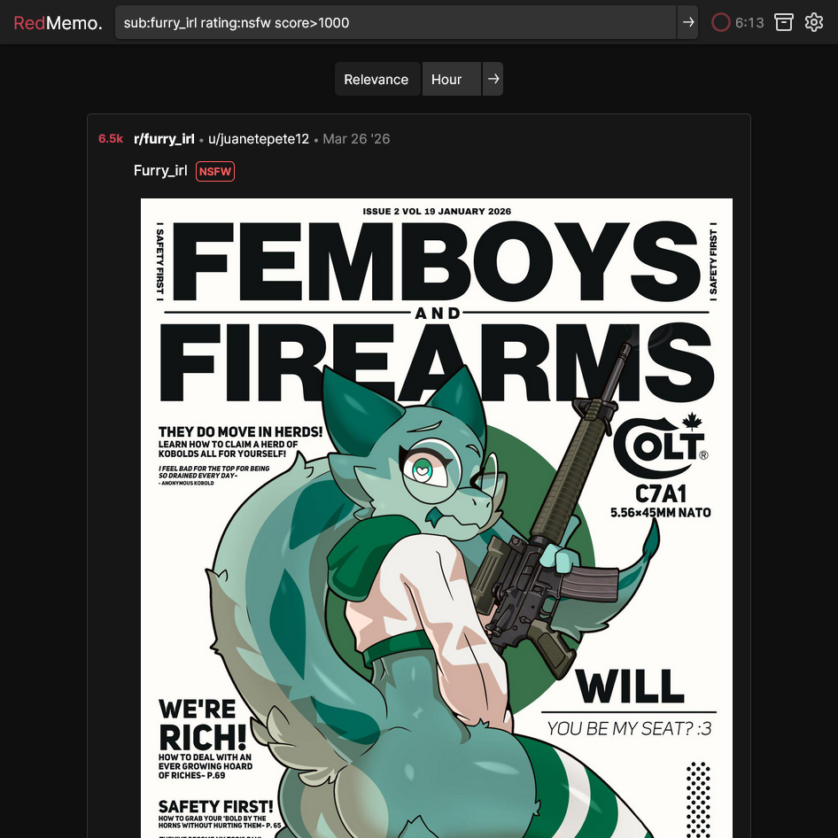
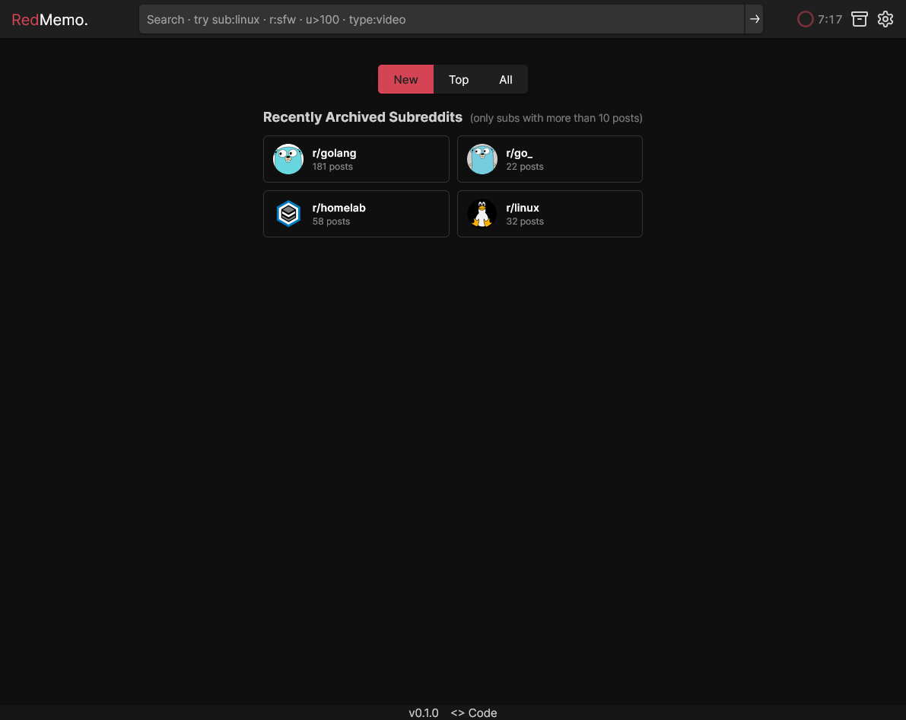
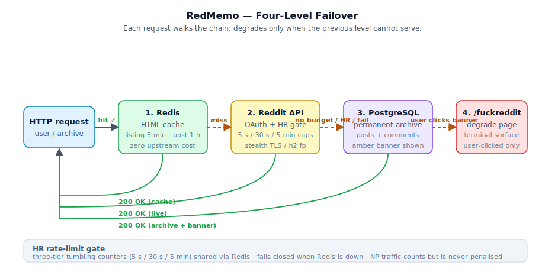
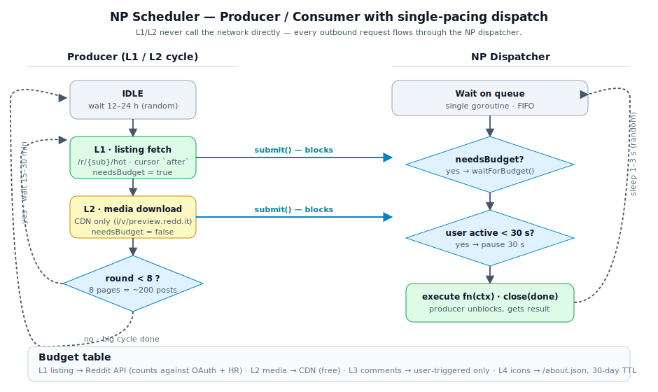

# RedMemo

> A self-hosted Reddit **archive station** with permanent local storage, built on the shoulders of [Redlib](https://github.com/redlib-org/redlib) and its ancestor [Libreddit](https://github.com/libreddit/libreddit).


<sub>RedMemo serving <code>/r/golang</code> — UI inherited verbatim from Redlib, content served from the local archive when upstream is rate-limited.</sub>

---

**10-second pitch:** RedMemo is what happens when you take Redlib's UI, rewrite the back-end in Go, and treat every fetched post / comment / image as something to *keep forever*. The same routes, themes and cookies you already know from Redlib — plus a Postgres + content-addressed media archive underneath, a passive natural-prefetch scheduler, and a TOTP-gated `/settings` panel.

- 🗄 **Persistent**: every post & media blob you've ever seen lives in Postgres + an on-disk content-addressed store. Reddit deletions don't take your archive with them.
- 🐢 **Passive**: when upstream is blocked or rate-limited, requests degrade to the local archive with a small banner — never a hard 5xx.
- 🔐 **Gated**: `/settings` is locked behind a pre-shared server secret + TOTP, with 3-strike per-IP lockout.
- 🦫 **Go + templ**: server-side rendered via Go's templ; no JS framework, no client hydration, no client-side state.

---

RedMemo keeps the UI and route shape you already know from Redlib and adds three things on top:

1. **Persistent archive** — every post, comment tree and media blob that passes through is written to PostgreSQL and to a content-addressed media store. Once a thing has been seen by your instance, it never disappears even if Reddit removes it or your upstream quota runs dry.
2. **Natural Prefetch (NP)** — a four-layer background scheduler (L1 listing / L2 media / L3 on-demand comments / L4 sub icons) that slowly fills the archive with human-like timing rather than burst polling.
3. **HR rate-limit layer** — a three-tier tumbling-window cap (5 s / 30 s / 5 min) shared across all instances via Redis, so a busy front-end gracefully degrades to "archived content" with a small banner instead of slamming Reddit and getting blocked.

The rendering layer, theme list, cookie-based user settings and most route handlers are direct ports of Redlib's templates, so the day-to-day browsing experience is identical.

---

## Credits

RedMemo would not exist without:

- **[Redlib](https://github.com/redlib-org/redlib)** — the entire front-end (templates, styles, themes, route shape, user-settings model) descends from Redlib. We additionally consume Redlib's settings-export format directly so users can migrate cookies one-to-one. A reference copy lives in `_redlib_ref/`.
- **[Libreddit](https://github.com/libreddit/libreddit)** — the original alternative front-end Redlib was forked from, and the ultimate source of the UI everyone recognises.

This project keeps Redlib's AGPL-3.0 license for any code it carries over.

---

## Migration from Redlib — Key Differences

If you're coming from a running Redlib instance, the user-facing UI is intentionally the same — themes, layouts, cookies, route shape, search syntax all carry over (and `REDLIB_*` env vars are auto-translated, see [Legacy redlib sync](#legacy-redlib-sync)). The underlying philosophy, however, is meaningfully different. Four things to know:

### 1. Passive archive site (upstream-restricted by design)

Redlib is a **live proxy**: every page view triggers an upstream Reddit call, and if Reddit blocks the request the user gets an error. RedMemo flips that model — it is first and foremost an **archive station** that happens to fetch fresh content when it can.

- Outbound traffic is hard-capped by the HR three-tier limiter (5 s / 30 s / 5 min tumbling windows). When any tier trips, foreground requests **degrade to the local archive** with a small amber "You are browsing archived content" banner instead of erroring out.
- Explicit `/archive/...` routes never attempt upstream and never consult HR — they serve from Postgres unconditionally.
- The same applies when the OAuth quota is exhausted, when Redis is unreachable (HR fails closed), or when the upstream call itself fails: archive fallback first, `/fuckreddit` only if the user explicitly clicks the banner.
- This means RedMemo behaves correctly even when self-hosted on a residential IP that Reddit eventually rate-limits — the archive keeps serving while NP slowly refills it.

### 2. New authentication model (server secret + TOTP)

Redlib has no admin auth — `/settings` is a public cookie-write surface for anyone with a browser. RedMemo adds two layers in front of `/settings`:

- **`REDMEMO_SERVER_SECRET`** — a pre-shared instance secret that gates **enrolment**. Without it the server refuses to start, and `/settings` can't be re-enrolled by a casual visitor even if they reach the page.
- **TOTP** — a per-instance authenticator-app secret stored in Postgres (`totp_enrollment` table). Verification is rate-limited per IP with a 3-strike lockout (`auth_strikes` table), and the trusted-proxy CIDR list (`server.trusted_proxy_cidrs`) decides whether `X-Forwarded-For` is honoured when deriving the per-request IP.
- Operators get an administrative CLI reset command for the case where the authenticator device is lost.

In short: Redlib trusts the network; RedMemo trusts an authenticator app + a secret you set at deploy time.


<sub>The TOTP prompt guarding <code>/settings</code>. 3-strike per-IP lockout, enrolment gated by <code>REDMEMO_SERVER_SECRET</code>.</sub>

### 3. Persistent storage (Postgres post archive + canonical media cache)

Redlib's storage model is "Redis HTML cache, that's it" — restart the process and the cache is empty. RedMemo's storage model is "Redis is a hot cache, **Postgres is the system of record**, the media root is a content-addressed CDN":

- **`posts` / `comments` / `subreddits`** in Postgres are append-only. Comment trees keep every snapshot (`(post_url_path, fetched_at)` primary key). The original `created_utc` from Reddit is preserved on every row so chronological sort works on archived data without an upstream call.
- **Canonical media cache** uses the two-table content-addressed design (`media_url` ⇒ `media_content`). Three stacked dedup layers:
  - **`canonical_key`** — strips the URL query so `preview.redd.it?width=320&s=…` and `…?width=640&s=…` collapse to one row.
  - **`content_hash`** — `sha256(file_bytes)` is the on-disk identity, so cross-post mirrors share one blob.
  - **bigger-wins** — when a fresh fetch under an existing canonical key produces a larger file (thumbnail first, source later), the URL repoints to the new content and the old file is reclaimed.
- Files live at `<root>/<hash[:2]>/<hash>` and are served by nginx via `X-Accel-Redirect` — Go never sits on the IO path. Eviction is `file_size_MB × hours_since_last_access` at 80 % of the disk cap, and an evicted file is transparently re-downloaded on next access (the `media_url`/`media_content` row stays; only `file_path` is NULLed).
- OAuth tokens, prefetch config, sub icons and TOTP enrolment all persist in Postgres too, so a container restart loses no state.

### 4. Refactor in Go (templ SSR, no JS framework)

Redlib is written in **Rust** on top of Hyper, with Askama for templating. RedMemo is a full ground-up **Go** rewrite:

- **Go** for the back-end (`internal/`, `cmd/redmemo`) — same `bogdanfinn/tls-client` for the outbound transport, so the TLS ClientHello and HTTP/2 (Akamai h2) fingerprints still match the official Reddit Android client.
- **templ** for SSR — the entire UI is server-side rendered into static HTML by Go templates that mirror Redlib's Askama tree. No JS framework, no client-side hydration, no SPA shell.
- The four-layer Natural Prefetch scheduler, the HR rate-limit gate, the `media_content`/`media_url` content-addressed store and the TOTP gate are all native Go code with no Rust counterpart in Redlib.
- Build artefacts are a single static Go binary (plus the Postgres + Redis + nginx side-car services in compose). No BoringSSL bring-up, no `cargo` toolchain, no NASM / LLVM / CMake build dependencies on Windows.

### 5. e621-compatible unified search

Redlib forwards the search box straight to Reddit's Lucene parser, so power-user queries have to be typed in Reddit's own `subreddit:` / `author:` / `nsfw:yes` dialect, and the API gives no way to filter by score, comment count or an exact date range. RedMemo replaces the box with a single **e621-style** parser (`internal/searchquery`) that drives **both** the live `/search` and the offline `/archive` from the same typed query — constraints Reddit's API can't express degrade to a local post-filter over the JSON results, so the two surfaces stay consistent.

In **live mode** (`/search`) the following e621-style tokens are accepted alongside free text. The full table — aliases, media types, date constraints — is in [Search & URL query reference](#search--url-query-reference).

- **`sub:`** — greedy whitelist / blacklist of subreddits. `sub:golang+rust` keeps only those subs, `sub:-meta` excludes one, and both forms can be mixed (`sub:golang+rust sub:-sfw`). Replaces Redlib's "restrict to r/x" checkbox; subreddit scoping is now explicit and editable in the box.
- **`rating:`** — `rating:nsfw` / `rating:safe`. Translates to Reddit's `nsfw:yes` / `nsfw:no`.
- **`score:`** *(also `upvote:` / `u>N` / `ups>N`)* — Reddit post score threshold (`score>1000`, `score>=50`, `score:100`). Live results are post-filtered locally because Reddit's search API has no score operator.
- **`author:`**, **`flair:`**, **`type:image|video|gif|gallery|text|link`**, **`comments<op>N`**, **`after:YYYY-MM-DD` / `before:YYYY-MM-DD`** — same syntax on both back-ends.

Example: `sub:rust rating:nsfw score:>1000` becomes `subreddit:rust nsfw:yes` upstream, with the score threshold applied as a local post-filter on the returned posts.



<sub>Live <code>/search</code> driven by the unified parser. The same query also works verbatim against the offline <code>/archive</code>, where every constraint is pushed into SQL instead.</sub>

---

## Table of Contents

1. [Migration from Redlib — Key Differences](#migration-from-redlib--key-differences)
   - [Passive archive site](#1-passive-archive-site-upstream-restricted-by-design)
   - [New authentication model (server secret + TOTP)](#2-new-authentication-model-server-secret--totp)
   - [Persistent storage](#3-persistent-storage-postgres-post-archive--canonical-media-cache)
   - [Refactor in Go (templ SSR)](#4-refactor-in-go-templ-ssr-no-js-framework)
   - [e621-compatible unified search](#5-e621-compatible-unified-search)
2. [Features](#features)
3. [Architecture overview](#architecture-overview)
   - [Failover chain](#failover-chain)
   - [Persistence layer (PostgreSQL + media store)](#persistence-layer-postgresql--media-store)
   - [Natural Prefetch (NP)](#natural-prefetch-np)
   - [HR rate-limit layer](#hr-rate-limit-layer)
3. [Deployment](#deployment)
   - [Docker Compose (recommended)](#docker-compose-recommended)
   - [Building from source](#building-from-source)
4. [Configuration](#configuration)
   - [Config file vs. environment variables](#config-file-vs-environment-variables)
   - [Server settings](#server-settings)
   - [Auth / TOTP gate](#auth--totp-gate)
   - [PostgreSQL](#postgresql)
   - [Redis](#redis)
   - [Media store](#media-store)
   - [OAuth tokens](#oauth-tokens)
   - [Android user-agent](#android-user-agent)
   - [Rate-limit budget](#rate-limit-budget)
   - [Natural Prefetch](#natural-prefetch)
   - [HR rate-limit layer](#hr-rate-limit-layer-1)
   - [Render / branding](#render--branding)
   - [SEO](#seo)
   - [Legacy redlib sync](#legacy-redlib-sync)
   - [Default user settings (`REDMEMO_DEFAULT_*`)](#default-user-settings-redmemo_default_)
5. [Search & URL query reference](#search--url-query-reference)
6. [License](#license)

---

## Features

- Drop-in Reddit front-end UI inherited from Redlib (all themes, all layouts, all user-toggles).
- **Permanent archive**: posts and comment-tree snapshots are stored in PostgreSQL, media is stored on disk with SHA-256 content addressing and three-layer dedup.
- **Four-level failover** per request: Redis HTML cache → Reddit API → PostgreSQL archive → `fuckreddit` degrade page.
- **Natural Prefetch**: low-rate background crawler that fills the archive without bursting (12–24 h big cycles, 15–30 min inter-round gaps, 1–3 s inter-request jitter).
- **HR rate limiter**: global three-tier tumbling cap on outgoing Reddit traffic, shared via Redis across multiple instances, with fail-closed behaviour when Redis is down.
- **TOTP-gated `/settings`** with 3-strike per-IP lockout, persistent enrolment in PostgreSQL and an administrative CLI reset command.
- **Archive surfaces** (`/archive`, `/archive/r/<sub>`) with optional SEO opt-in (`robots.txt` + `sitemap.xml`, off by default).



<sub>The <code>/archive</code> hub — every sub RedMemo has ever seen, grouped by NSFW visibility, with the local icon cache (L4).</sub>
- **Per-instance random media endpoint** (`/random`) with `t:` filter language (e.g. `t:img`, `t:vid-gif`, `t:ins`).
- **`dl_title` redirect parameter** so videos served by `/random` come back as friendly filenames (`<post_title>_vreddit_id_format.mp4`).
- **Direct Reddit transport** using `bogdanfinn/tls-client` with matching ClientHello and HTTP/2 fingerprints — no external `redlib` instance required.

---

## Architecture overview



See [`docs/architecture.md`](docs/architecture.md), [`docs/storage-design.md`](docs/storage-design.md), [`docs/prefetch.md`](docs/prefetch.md), [`docs/HR.md`](docs/HR.md) for the full design.

### Failover chain

Every front-end request walks a four-step ladder. The first step that returns wins:

1. **Redis HTML cache** — TTL 5 min for listings, 1 h for post pages. Zero upstream cost.
2. **Reddit API** — gated by both the OAuth quota window and the HR cooldown gate (see below).
3. **PostgreSQL archive** — if the upstream call cannot be made (no budget, HR cooldown, network failure), the cached `posts` / `comments` rows are rendered with an amber "You are browsing archived content" banner. Clicking the banner takes the user to `/fuckreddit?reason=...`.
4. **`/fuckreddit` page** — terminal degrade surface, only reached if the user explicitly clicks the banner.

### Persistence layer (PostgreSQL + media store)

PostgreSQL is the system of record. All schema changes are forward-only migrations in `internal/store/migrate.go`.

Main tables (full schema in [`docs/storage-design.md`](docs/storage-design.md)):

| Table | Purpose |
|-------|---------|
| `posts` | Permanent append-only post archive (`json_data` JSONB + cached `rendered_html`). Carries `source` (`oauth_fallback` / `prefetch` / `natural_prefetch` / `redlib_proxy`), `media_done` flag for NP L2, `last_updated` for sitemap regeneration. |
| `comments` | Multiple snapshot revisions per post keyed by `(post_url_path, fetched_at)`; the newest snapshot is served by default. |
| `subreddits` | About metadata + JSON dump per sub. |
| `media_content` | Content-addressed asset row keyed by `sha256(file_bytes)`. Holds `file_path` (NULL = evicted), `mime_type`, `audio_state` for v.redd.it, eviction counters. |
| `media_url` | URL alias table. Keyed by `CanonicalKey(rawURL)` (scheme + host + path, query stripped) → `content_hash`. Three layers of dedup: canonical-key, content-hash and bigger-wins variant-upgrade. |
| `oauth_tokens` | Persistent OAuth pool with live `rate_remaining` / `rate_reset_at`. |
| `prefetch_config` | NP target list with sort, max pages, fetch toggles, priority. |
| `sub_icons` | L4 icon cache with TTL (default 30 days). |
| `totp_enrollment` / `auth_strikes` | TOTP secret + per-IP lockout state for the `/settings` gate. |

**Media on disk**: layout is `<root>/<hash[:2]>/<hash>` with no extension. The MIME type lives in `media_content.mime_type`. Nginx serves blobs via `X-Accel-Redirect`; Go never touches the IO path after writing. Eviction is `file_size_MB × hours_since_last_access`, triggered when usage exceeds `media.eviction_threshold` (default 80 % of `max_size_gb`). Evicted files have `file_path` NULLed but the row stays — the next request re-downloads transparently.

**Redis** holds only volatile state: the HTML cache, current rate-limit window counters, HR tumbling-window counters, the active OAuth token id, settings-cookie cache and media access-counter aggregation buffer. AOF is enabled (`--appendonly yes --appendfsync everysec`) so HR cooldown survives a restart with at most ~1 s of loss.

### Natural Prefetch (NP)

NP is a producer/consumer pipeline that quietly fills the archive without burst patterns. All outbound traffic — both the L1 Reddit-API listing fetch and the L2 CDN media downloads — flows through one **NP dispatcher** goroutine that applies a 1–3 s random delay between calls and pauses 30 s after any user-triggered upstream request.

| Layer | Trigger | Cost / round | Behaviour |
|-------|---------|--------------|-----------|
| **L1** Shallow archive | Big cycle every 12–24 h, up to 8 rounds per cycle, 15–30 min between rounds | 1 Reddit API request | Walks `hot` listing with `after` cursor for ~200 posts per cycle. UPSERTs into `posts`, preserves `media_done`. Identifies new posts and hands them to L2. |
| **L2** Media archive | Runs immediately after each L1 round | 0 Reddit API requests | Sorts new posts newest-first, downloads image/video/gallery via CDN, marks `media_done = true`. Verifies files still exist on disk and re-downloads if evicted. |
| **L3** Deep archive | Passive — user visits a post page | 1 Reddit API request on demand | Comments are only ever fetched when a human asks for them. |
| **L4** Icon cache | Startup + every 1 h + on `/archive` view | 1 Reddit API request per sub when stale | Keeps `sub_icons` fresh (default TTL 30 days). Icon image itself is a CDN download. |

L1 and L2 never call the network directly — they submit work items to the dispatcher and block until it runs them, so a single pacing layer governs everything. See [`docs/prefetch.md`](docs/prefetch.md) for the producer/consumer state machine.



### HR rate-limit layer

HR (Human and Robots) caps the **total** outbound Reddit traffic at three tumbling-window granularities. Counters in Redis are wall-clock-aligned, so multiple RedMemo instances behind a load balancer share one global budget without coordination.

| Tier | Window | Threshold | Cooldown when tripped |
|------|--------|-----------|------------------------|
| L1   | 5 s    | ≥ 5 requests | remainder of current window + the next full window |
| L2   | 30 s   | ≥ 15 requests | same |
| L3   | 5 min  | ≥ 50 requests | same |

Important properties:

- **Counters count both HR and NP traffic**, but **only HR requests are penalised**. Background prefetch continues even while HR is cooling down (it just contributes to tripping the cap).
- HR-cooldown does **not** hard-block the user. Instead the request is served from the archive with an amber banner that links to `/fuckreddit?reason=hr_cooldown_L1` (or similar).
- The HR gate is placed just before an upstream call would be issued, not at the outermost handler. Pure cache hits and explicit `/archive/...` routes never consult HR.
- **Failure mode**: if Redis is unreachable, HR fails **closed** (`reason=hr_redis_down`) — admitting traffic blind would let the cap leak. Redis is re-probed on exponential backoff (1 s → 30 s) and `/fuckreddit` actively pings to detect recovery.

Counter / cooldown atomicity is guaranteed by a single Lua script that performs `INCR` + `EXPIRE` + (conditionally) `SET cooldown` per tier on every successful upstream call. See [`docs/HR.md`](docs/HR.md).

---

## Deployment

### Docker Compose (recommended)

`docker-compose.yml` ships a four-service stack: `redmemo` + `postgres` + `redis` + `nginx`. Two environment variables are **required** — the compose file uses `${VAR:?…}` so it refuses to start without them:

| Variable | Purpose |
|----------|---------|
| `PG_PASSWORD` | Password for the Postgres user used by the DSN. |
| `SERVER_SECRET` | Pre-shared secret required before TOTP enrolment / re-enrolment in `/settings`. |

Database (5432) and Redis (6379) ports are **not** exposed to the host — they live on the internal compose network only.

```bash
cp .env.example .env       # fill in PG_PASSWORD and SERVER_SECRET
docker compose up -d
docker logs -f redmemo
```

`.env.example` is tracked in version control; `.env` is ignored.

### Building from source

Requires Go ≥ 1.22. The project never runs `go build` automatically — use the Makefile only when you need a local binary.

```bash
git clone https://github.com/<you>/redmemo && cd redmemo
make build
./bin/redmemo -config config.yaml
```

The outbound HTTP transport is `bogdanfinn/tls-client`, which embeds its own TLS stack, so no system `openssl`/`boringssl` is required at build time.

---

## Configuration

### Config file vs. environment variables

RedMemo loads `config.yaml` first, then layers `REDMEMO_*` environment variables on top. The example file is `config.example.yaml`.

Two compatibility shims make migration from Redlib painless:

- Any `REDLIB_*` (and to a lesser degree `LIBREDDIT_*`) variable is automatically translated into the matching `REDMEMO_*` variable at startup unless the latter is already set. Precedence: `REDMEMO_*` > `REDLIB_*` > `LIBREDDIT_*`.
- `PORT` / `REDLIB_PORT` is translated into `REDMEMO_SERVER_LISTEN=:<port>` (Heroku-style).

### Server settings

| YAML key | Env var | Default | Description |
|----------|---------|---------|-------------|
| `server.listen` | `REDMEMO_SERVER_LISTEN` | `:8080` | Listen address. Accepts `:port` or `host:port`. |
| `server.read_timeout` | `REDMEMO_SERVER_READ_TIMEOUT` | `30s` | HTTP server read timeout (Go duration). |
| `server.write_timeout` | `REDMEMO_SERVER_WRITE_TIMEOUT` | `60s` | HTTP server write timeout. |
| `server.trusted_proxy_cidrs` | — | `[]` | CIDRs whose `X-Forwarded-For` is trusted when deriving the client IP for `/settings` lockout. Leave empty when exposed directly; add the reverse proxy's CIDR (`127.0.0.1/32`, `10.0.0.0/8`) behind nginx/caddy. |

### Auth / TOTP gate

| YAML key | Env var | Required | Description |
|----------|---------|----------|-------------|
| `auth.server_secret` | `REDMEMO_SERVER_SECRET` | **yes** | Pre-shared secret required before TOTP enrolment. Startup refuses to launch without it. |

The administrative reset command (clears enrolment and lockouts) is documented in `docs/project-status.md`.

### PostgreSQL

| YAML key | Env var | Default | Description |
|----------|---------|---------|-------------|
| `postgres.dsn` | `REDMEMO_POSTGRES_DSN` | — (required) | Full DSN, e.g. `postgres://redmemo:pw@postgres:5432/redmemo?sslmode=disable`. |
| `postgres.max_open_conns` | — | `50` | Connection pool ceiling. |
| `postgres.max_idle_conns` | — | `10` | Idle connection target. |

### Redis

| YAML key | Env var | Default | Description |
|----------|---------|---------|-------------|
| `redis.addr` | `REDMEMO_REDIS_ADDR` | — (required) | `host:port`. |
| `redis.password` | `REDMEMO_REDIS_PASSWORD` | (empty) | Optional. |
| `redis.db` | — | `0` | DB number. |
| `redis.max_memory_mb` | — | `256` | `maxmemory` enforced via `allkeys-lru`. Working set for HR + sessions is < 1 MB; the rest is HTML cache. |

### Media store

| YAML key | Env var | Default | Description |
|----------|---------|---------|-------------|
| `media.root_path` | `REDMEMO_MEDIA_ROOT_PATH` | — (required) | On-disk root, e.g. `/data/media`. Layout: `<root>/<hash[:2]>/<hash>`. |
| `media.max_size_gb` | `REDMEMO_MEDIA_MAX_SIZE_GB` | `50` | Soft cap. Eviction starts at `max_size_gb × eviction_threshold`. |
| `media.eviction_check_interval` | `REDMEMO_MEDIA_EVICTION_CHECK_INTERVAL` | `5m` | How often the eviction goroutine wakes up. |
| `media.eviction_threshold` | `REDMEMO_MEDIA_EVICTION_THRESHOLD` | `0.8` | Float in `[0, 1]`. Trigger eviction at this fraction of `max_size_gb`. |

### OAuth tokens

```yaml
oauth:
  tokens:
    - client_id: "ohXpoqrZYub1kg"
      backend: "mobile_spoof"
```

| Field | Allowed values | Description |
|-------|----------------|-------------|
| `client_id` | string | Reddit OAuth client id (required). |
| `client_secret` | string | Optional — most mobile-spoof flows use the public client. |
| `backend` | `mobile_spoof` \| `generic_web` | Selects the OAuth flow + header set. `mobile_spoof` mimics the official Android app. |

### Android user-agent

Only consumed by the `mobile_spoof` backend. Priority: **`USER_AGENT` > `APP_VERSION` > `APP_DATE` > built-in default**. Keeping these current is recommended — Reddit dislikes stale UA strings.

| Env var | Description |
|---------|-------------|
| `REDMEMO_ANDROID_USER_AGENT` | Full UA string used verbatim — highest priority, disables randomisation. e.g. `Reddit/Version 2026.07.0/Build 2607141/Android 14`. |
| `REDMEMO_ANDROID_APP_VERSION` | Comma-separated `Version YYYY.WW.X/Build NNNNNNN` entries; one picked at random per token. |
| `REDMEMO_ANDROID_APP_DATE` | Date `YYYY-MM-DD`; auto-translated to a synthesised version+build. Ignored if `APP_VERSION` is set. |
| `REDMEMO_ANDROID_OS_VERSION` | Android major version. Fixed (`14`) or range (`12-15`). |

See [`docs/android-user-agent.md`](docs/android-user-agent.md) for the full table of known builds.

### Rate-limit budget

This is the **OAuth-side** budget tracker (parsed from Reddit's `X-Ratelimit-Remaining/Reset` headers), separate from the HR limiter below.

| YAML key | Env var | Default | Description |
|----------|---------|---------|-------------|
| `ratelimit.window_size` | `REDMEMO_RATELIMIT_WINDOW_SIZE` | `500` | Conservative cap per window. |
| `ratelimit.window_duration` | `REDMEMO_RATELIMIT_WINDOW_DURATION` | `10m` | Reddit's rolling window. |
| `ratelimit.safety_buffer` | `REDMEMO_RATELIMIT_SAFETY_BUFFER` | `50` | Reserved for NP / prefetch so user traffic always wins. |

### Natural Prefetch

| YAML key | Env var | Default | Description |
|----------|---------|---------|-------------|
| `prefetch.enabled` | `REDMEMO_PREFETCH_ENABLED` | `true` | Master switch for L1/L2/L4. |
| `prefetch.check_interval` | `REDMEMO_PREFETCH_CHECK_INTERVAL` | `30s` | Dispatcher tick. |
| `prefetch.subreddits[]` | — | `[]` | Target list. |

Per-sub entry:

```yaml
- name: "golang"
  sort: "hot"        # hot | new | top | rising | controversial
  max_pages: 2       # how many 25-post pages per big cycle
  fetch_comments: true
  fetch_media: true
  priority: 10       # higher = scheduled earlier
```

### HR rate-limit layer

| YAML key | Default | Description |
|----------|---------|-------------|
| `hrlimit.enabled` | `true` | Master switch. When false, `Admit` always allows; `RecordUpstream` is a no-op. |
| `hrlimit.l1_window` | `5s` | L1 tumbling window. |
| `hrlimit.l1_threshold` | `5` | Requests that trip L1. |
| `hrlimit.l2_window` | `30s` | L2 tumbling window. |
| `hrlimit.l2_threshold` | `15` | Requests that trip L2. |
| `hrlimit.l3_window` | `5m` | L3 tumbling window. |
| `hrlimit.l3_threshold` | `50` | Requests that trip L3. |

There is no equivalent env-var override for HR — change `config.yaml` to retune.

### Render / branding

| YAML key | Env var | Default | Description |
|----------|---------|---------|-------------|
| `render.brand_name` | `REDMEMO_RENDER_BRAND_NAME` | `RedMemo` | Title / navbar brand. |
| `render.show_archive_badge` | `REDMEMO_RENDER_SHOW_ARCHIVE_BADGE` | `true` | When false, suppress the small "from archive" badge on pages served without an upstream call. |

### SEO

Off by default. When `allow_indexing=false`: `/robots.txt` is `Disallow: /`, `/sitemap.xml` 404s, every page emits `<meta name=robots content="noindex,nofollow">`.

| YAML key | Env var | Default | Description |
|----------|---------|---------|-------------|
| `seo.allow_indexing` | `REDMEMO_SEO_ALLOW_INDEXING` | `false` | Master switch for indexing the archive surfaces (`/archive`, `/archive/r/<sub>`). |
| `seo.canonical_host` | `REDMEMO_SEO_CANONICAL_HOST` | (empty) | Public origin used for absolute URLs in `sitemap.xml` and `<link rel="canonical">`. Leave empty to fall back to root-relative URLs. e.g. `https://memo.example.com`. |

### Legacy redlib sync

A one-time helper for users migrating from an existing Redlib instance: pulls user settings (theme, layout, etc.) from the old instance on first visit so cookies feel continuous.

| YAML key | Env var | Default | Description |
|----------|---------|---------|-------------|
| `legacy.sync_enabled` | `REDMEMO_LEGACY_SYNC` | `true` | Disable once everyone has migrated. |
| `legacy.instance` | `REDMEMO_LEGACY_INSTANCE` | empty → `http://redlib:8080` | Override the docker DNS name if your legacy instance lives elsewhere. |

### Default user settings (`REDMEMO_DEFAULT_*`)

Like Redlib, every per-user setting can be given an **instance-wide default** by setting `REDMEMO_DEFAULT_<COOKIE>=<value>`. Cookie names map 1:1 from Redlib so existing deployments can rename `REDLIB_DEFAULT_*` to `REDMEMO_DEFAULT_*` (or rely on auto-translation). The list is dynamic — anything you set is exposed; the table below is the well-known set inherited from Redlib.

| Name | Possible values | Default |
|------|-----------------|---------|
| `THEME` | `system`, `light`, `dark`, `black`, `dracula`, `nord`, `laserwave`, `violet`, `gold`, `rosebox`, `gruvboxdark`, `gruvboxlight`, `tokyoNight`, `icebergDark`, `doomone`, `libredditBlack`, `libredditDark`, `libredditLight` | `system` |
| `FRONT_PAGE` | `default`, `popular`, `all` | `default` |
| `LAYOUT` | `card`, `clean`, `compact` | `card` |
| `WIDE` | `on`, `off` | `off` |
| `POST_SORT` | `hot`, `new`, `top`, `rising`, `controversial` | `hot` |
| `COMMENT_SORT` | `confidence`, `top`, `new`, `controversial`, `old` | `confidence` |
| `BLUR_SPOILER` | `on`, `off` | `off` |
| `SHOW_NSFW` | `on`, `off` | `off` |
| `BLUR_NSFW` | `on`, `off` | `off` |
| `USE_HLS` | `on`, `off` | `off` |
| `HIDE_HLS_NOTIFICATION` | `on`, `off` | `off` |
| `AUTOPLAY_VIDEOS` | `on`, `off` | `off` |
| `SUBSCRIPTIONS` | `+`-separated list (`sub1+sub2+sub3`) | _(none)_ |
| `HIDE_AWARDS` | `on`, `off` | `off` |
| `DISABLE_VISIT_REDDIT_CONFIRMATION` | `on`, `off` | `off` |
| `HIDE_SCORE` | `on`, `off` | `off` |
| `HIDE_SIDEBAR_AND_SUMMARY` | `on`, `off` | `off` |
| `FIXED_NAVBAR` | `on`, `off` | `on` |
| `REMOVE_DEFAULT_FEEDS` | `on`, `off` | `off` |
| `SFW_ONLY` | `on`, `off` | `off` |

Instance-only toggles (no per-user equivalent):

| Name | Possible values | Default | Description |
|------|-----------------|---------|-------------|
| `REDMEMO_DEFAULT_BANNER` | string | (empty) | Banner string for the instance info page. |
| `REDMEMO_DEFAULT_PUSHSHIFT_FRONTEND` | string | `undelete.pullpush.io` | Where "removed" links point. |
| `REDMEMO_DEFAULT_ENABLE_RSS` | `on`, `off` | `off` | Toggle RSS feeds. |
| `REDMEMO_DEFAULT_FULL_URL` | string | (empty) | Public URL — needed by RSS for absolute links. |

---

## Search & URL query reference

The search parser is a single **e621-style** grammar (`internal/searchquery`) shared between the live `/search` and the offline `/archive`. Free-text words become the title/body match; everything else is a `key:value` (or `key<op>value`) constraint. Tokens can appear in any order; the same query targets both back-ends.

| Token | Aliases | Meaning | Live `/search` | Archive `/archive` |
|-------|---------|---------|----------------|--------------------|
| `sub:<a>+<b>` | `s:` `sr:` `subreddit:` | Whitelist (only these subs) | `(subreddit:a OR subreddit:b)` | `LOWER(subreddit) = ANY(...)` |
| `sub:-<a>-<b>` | — | Blacklist (exclude these subs) | `-subreddit:a -subreddit:b` | `LOWER(subreddit) != ALL(...)` |
| `rating:nsfw` / `rating:safe` | `r:` | NSFW / SFW only | `nsfw:yes` / `nsfw:no` | `over_18 = true/false` |
| `author:<user>` | `a:` `user:` | Post author | `author:<user>` | `LOWER(author) = ...` |
| `flair:"<text>"` | `f:` | Flair text | `flair_name:"<text>"` | *(ignored — not indexed)* |
| `score<op>N` | `upvote<op>N` `u<op>N` `ups<op>N` | Reddit post score threshold | *(local post-filter)* | `score <op> N` |
| `comments<op>N` | `c<op>N` | Comment count threshold | *(local post-filter)* | `(Comments)::int <op> N` |
| `type:image` | `t:` `media:` | Image / gallery posts | *(local post-filter)* | `PostType IN ('image','gallery')` |
| `type:video` | — | Real video (`is_gif=false`) | *(local post-filter)* | `PostType='video'` |
| `type:gif` | — | GIF upload (`is_gif=true`) | *(local post-filter)* | `PostType='gif'` |
| `after:YYYY-MM-DD` | `since:` | Created on/after | *(local post-filter)* | `created_utc >= date` |
| `before:YYYY-MM-DD` | `until:` | Created on/before | *(local post-filter)* | `created_utc <= date` |

Numeric `<op>` is one of `>`, `<`, `>=`, `<=`, `=` (and `:` as `=`, e.g. `score:100`). Note that `score:` here is the **Reddit post score**, the same quantity as `upvote:` / `ups:` — there is also a distinct **media cache eviction score** filter that exists only on `/archive` and `/random`; see [`docs/reddit-search.md`](docs/reddit-search.md) for that nuance.

### `/random` and the `t:` media filter

`/random` selects a random archived post and 302-redirects to its media. It accepts a compact `t:` filter language for shell consumers in addition to the full e621 grammar above:

| Modifier | Example | Meaning |
|----------|---------|---------|
| `t:<type>` | `t:img` | Include only posts whose media is of `<type>`. |
| `t:-<type>` | `t:-gif` | Exclude posts of `<type>`. |
| `t:<a>-<b>` | `t:vid-gif` | Include `<a>`, exclude `<b>`. Combinable: `t:img,vid,-gif`. |
| `t:ins` / `t:instant` | `t:ins` | Return the raw cached media (redirect) or post body as `text/plain` instead of a JSON envelope. |

Supported `<type>` tokens: `img`, `vid`, `gif`, `gallery`, `text`, `link`, `self`.

### `/random` endpoint

`/random` selects a random archived post matching the active filters and 302-redirects to its media (or returns the text body in `t:ins` mode). The downstream proxy understands a `dl_title` query parameter so the resulting `Content-Disposition` filename is human-friendly:

```
GET /random?t=vid
  → 302 /proxy/vreddit/<id>.mp4?dl_title=<post_title>
  → Content-Disposition: attachment; filename="post_title_vreddit_id_format.mp4"
```

---

## License

RedMemo inherits the AGPL-3.0 license of Redlib and Libreddit for the code paths derived from them. New code follows the same license unless explicitly stated.
