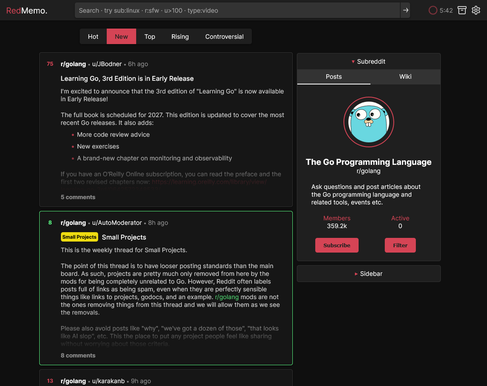
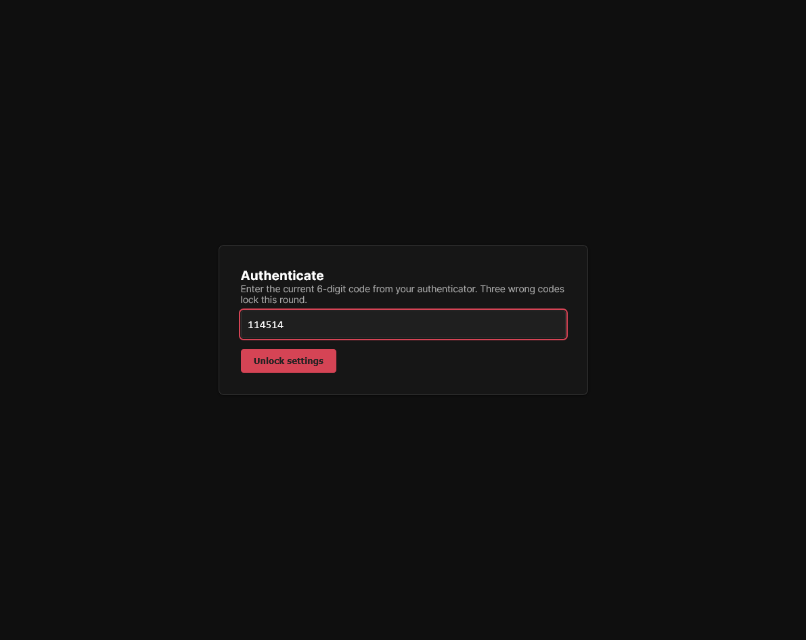

# RedMemo

**Language / 语言:** **English** · [简体中文](README.zh-CN.md)

> A self-hosted Reddit **archive station** with permanent local storage, built on the shoulders of [Redlib](https://github.com/redlib-org/redlib) and its ancestor [Libreddit](https://github.com/libreddit/libreddit).



<sub>RedMemo serving <code>/r/golang</code> — UI inherited verbatim from Redlib, content served from the local archive when upstream is rate-limited.</sub>

---

**10-second pitch.** Take Redlib's UI, rewrite the back-end in Go, cache the resources actively and passively. Same routes, themes and cookies you already know from Redlib — plus a Postgres + content-addressed media archive underneath, a passive natural-prefetch scheduler, and a TOTP-gated `/settings` panel.

- 🗄 **Persistent** — every post & media blob ever seen lives in Postgres + an on-disk content-addressed store. Reddit deletions don't take your archive with them.
- 🐢 **Passive** — when upstream is blocked or rate-limited, requests degrade to the local archive with a small banner, never a hard 5xx.
- 🔐 **Gated** — `/settings` is locked behind a pre-shared server secret + TOTP, with 3-strike per-IP lockout.
- 🦫 **Go + templ** — server-side rendered; no JS framework, no client hydration, no client-side state.
- 🔎 **Search** — e621-style unified grammar across local archive (`sub:`, `rating:`, `score:>1000`, `flair:`, …) — see the [Search & URL Reference](docs/Search-Reference.md).
- 💍 **Budget-aware** — sub/search pages fetch up to 50 posts per upstream call (operator-configurable 5–100), a live navbar ring shows the remaining budget for the current window, and the HR layer auto-throttles into the archive when it runs low — see the [Budget Design](docs/Budget-Design.md).

## TL;DR deploy

Two Compose profiles ship in `deploy/`:

### Homelab — LAN only, no auth gate

**When to pick this profile:**
- You have a clean residential IP, you're an adult, and you're the only one on the network — no auth gate needed, just point a browser at it.
- You front it with **SSO / forward-auth** (Authelia, Authentik, Tailscale Serve, Cloudflare Access, …) and want RedMemo itself to stay unauthenticated behind that perimeter.

```bash
mkdir redmemo && cd redmemo
curl -O https://raw.githubusercontent.com/Meeks233/Redmemo/main/deploy/docker-compose.homelab.yml
mv docker-compose.homelab.yml docker-compose.yml
echo "PG_PASSWORD=$(openssl rand -hex 24)" > .env
docker compose up -d
```

Visit `http://<host>:8080/`. No TOTP, intended for trusted networks.

### Public — TOTP-gated `/settings`, internet-facing

**When to pick this profile:**
- You can't control who reaches the site (link-sharing, public DNS, search-indexable) and you need RedMemo's built-in TOTP gate + 3-strike per-IP lockout doing the auth work.
- You want to lean on the **Archive hub** as a public resource — strangers can browse what RedMemo has already preserved, while `/settings` and prefetch controls stay locked behind enrolment.

```bash
mkdir redmemo && cd redmemo
curl -O https://raw.githubusercontent.com/Meeks233/Redmemo/main/deploy/docker-compose.public.yml
mv docker-compose.public.yml docker-compose.yml
cat > .env <<EOF
PG_PASSWORD=$(openssl rand -hex 24)
REDMEMO_SERVER_SECRET=$(openssl rand -hex 32)
EOF
docker compose up -d
```

RedMemo listens on `:8080` only — bring your own TLS-terminating reverse proxy (nginx, Caddy, Traefik, …) and forward to it. A sample nginx vhost lives at [`deploy/nginx.conf`](deploy/nginx.conf) as a reference (X-Accel-Redirect for `/media/`, static-asset caching, forwarded headers); adapt it to your own setup rather than wiring it in by default.

Enrol TOTP at `/settings` with the server secret, then bind 3-strike per-IP lockout. Full env-var matrix in [Quick Deployment](docs/Quick-Deployment.md).



<sub>The TOTP prompt guarding <code>/settings</code> on the public profile. 3-strike per-IP lockout, enrolment gated by <code>REDMEMO_SERVER_SECRET</code>.</sub>

## Documentation

The handbook lives in **[`docs/`](docs/README.md)**. Quick jumps:

- **[Quick Deployment](docs/Quick-Deployment.md)** — homelab and public Compose profiles
- **[Migration from Redlib](docs/Migration-from-Redlib.md)** — what's the same, what's different
- **[Architecture](docs/Architecture.md)** — four-level failover chain
- **[Persistence Layer](docs/Persistence.md)** — Postgres tables + media dedup
- **[Natural Prefetch](docs/Natural-Prefetch.md)** — passive background crawler
- **[HR Rate-Limit](docs/HR-Rate-Limit.md)** — global three-tier cap
- **[Budget Design](docs/Budget-Design.md)** — 50-per-call page size, navbar ring, auto-throttle
- **[Configuration Reference](docs/Configuration.md)** — every `REDMEMO_*` env var
- **[Default User Settings](docs/Default-User-Settings.md)** — `REDMEMO_DEFAULT_*` overrides
- **[Search & URL Reference](docs/Search-Reference.md)** — e621-style unified grammar

## Star History

<a href="https://www.star-history.com/#Meeks233/Redmemo&Date">
 <picture>
   <source media="(prefers-color-scheme: dark)" srcset="https://api.star-history.com/svg?repos=Meeks233/Redmemo&type=Date&theme=dark" />
   <source media="(prefers-color-scheme: light)" srcset="https://api.star-history.com/svg?repos=Meeks233/Redmemo&type=Date" />
   
 </picture>
</a>

## Credits

RedMemo would not exist without:

- **[Redlib](https://github.com/redlib-org/redlib)** — the entire front-end (templates, styles, themes, route shape, user-settings model) descends from Redlib.
- **[Libreddit](https://github.com/libreddit/libreddit)** — the original alternative front-end Redlib was forked from, and the ultimate source of the UI everyone recognises.
- **[Lucide](https://lucide.dev)** — a large portion of the SVG iconography (toolbar glyphs, status badges, archive-hub markers) is reused verbatim or with minor edits from the Lucide icon set (ISC), itself partly descended from [Feather](https://github.com/feathericons/feather) (MIT, © Cole Bemis).

## Disclaimer

RedMemo is an open-source, self-hosted tool. It is **not** affiliated with, endorsed by, or sponsored by Reddit, Inc. — "Reddit" is a trademark of Reddit, Inc. and is referenced here only descriptively. The project does not run or list public instances; if you choose to expose your instance to the public internet, you assume responsibility for compliance with the laws and platform terms that apply to your deployment. Rights-holders with concerns about material in *this source repository* can find a contact and takedown procedure in **[DISCLAIMER.md](DISCLAIMER.md)**.

## License

RedMemo is licensed under **[GNU AGPL-3.0-or-later](LICENSE)**. This is the same copyleft license as Redlib and Libreddit, and is required because RedMemo is a derivative work of Redlib's templates, themes, route shape, and user-settings model.

Concretely, anyone running a modified copy of RedMemo on a public server **must** offer the corresponding source code of that modified version to its users (AGPL §13). You are free to self-host, fork, sell support, or run it commercially; you are not free to ship a closed-source / SaaS-only fork.

Third-party attributions (Redlib, Libreddit, Lucide, Feather, and Go module dependencies) are catalogued in **[NOTICE](NOTICE)**.
